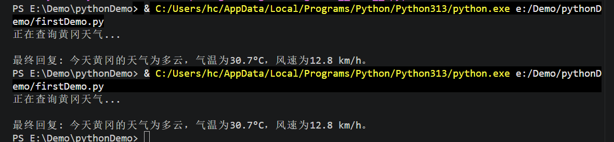

# Ai Agent学习记录

### 第一个Demo

下载vscode安装相关插件

访问https://langchain\-doc\.cn/v1/python/langchain/quickstart\.html，测试第一个demo

```Python
from langchain.agents import create_agent


def get_weather(city: str) -> str:
    """获取指定城市的天气。"""
    return f"{city}总是阳光明媚！"

agent = create_agent(
    model="anthropic:claude-sonnet-4-5",
    tools=[get_weather],
    system_prompt="你是一个乐于助人的助手",
)

# 运行代理
agent.invoke(
    {"messages": [{"role": "user", "content": "旧金山的天气怎么样"}]}
)
```


报错信息：

```JavaScript
**发生异常: ModuleNotFoundError**

No module named 'langchain'
  File "E:\Demo\pythonDemo\firstDemo.py", line 1, in <module>
    from langchain.agents import create_agent
ModuleNotFoundError: No module named 'langchain'
```


通过命令 安装插件：

```Plain Text
python -m pip install langchain
```

但是依旧报错，错误原因是，我本地有多个版本的 python ，默认安装的是3\.10版本的

通过 py \-3\.13 \-m pip install langchain来指定版本安装，这里也有个坑，需要把环境变量里面原本3\.10的地址全部删掉，缓存 3\.13版本的地址，

在终端查看python 版本 已经变成了3\.13版本

```Plain Text

PS E:\Demo\pythonDemo> python --version
Python 3.13.2
PS E:\Demo\pythonDemo> 

```


继续执行还是报错，分析以后得知

太棒了！环境终于彻底对齐了！🎉

从报错信息可以看出，你的 Python 3\.13 已经成功加载了 `langchain`，并且识别到了你要使用 Anthropic 的模型。

报错信息已经非常贴心地给出了提示：
`ImportError: Initializing ChatAnthropic requires the langchain-anthropic package.`

```Plain Text
python -m pip install langchain-anthropic
```

继续执行代码提示需要anthropic的api，目前我是没有的，就切换成了用千问的模型

安装插件

```Plain Text
python -m pip install langchain_openai
```

```Python
from langchain_openai import ChatOpenAI

# 使用通义千问模型
model = ChatOpenAI(
    model="qwen-turbo",  # 通义千问的模型名
    api_key="你的通义千问-API-Key",
    base_url="https://dashscope.aliyuncs.com/compatible-mode/v1"  # 阿里百炼兼容地址
)

response = model.invoke("你好，请介绍一下自己")
print(response.content)
```

这里有个坑，一直提示403，查了很多资料都没有解决，后来发现是我的阿里云账户里面金额是\-0\.05元，部分功能不可用，充值了10元，代码执行是正常的


### 查询天气案例


```Python
import json
import os
import requests
from langchain_openai import ChatOpenAI
from langchain_core.tools import tool
from langchain.agents import create_agent

# 1. 定义天气查询工具
@tool
def get_current_weather(location: str) -> str:
    """当用户询问某个城市或地点的实时天气、温度、降水等信息时，必须调用此工具。"""
    try:
        # 获取经纬度
        geo_url = f"https://geocoding-api.open-meteo.com/v1/search?name={location}&count=1&language=zh"
        geo_response = requests.get(geo_url).json()
        
        if "results" not in geo_response:
            return f"抱歉，我找不到 '{location}' 这个地点的地理坐标。"
            
        lat = geo_response["results"][0]["latitude"]
        lon = geo_response["results"][0]["longitude"]
        city_name = geo_response["results"][0]["name"]

        # 获取实时天气
        weather_url = f"https://api.open-meteo.com/v1/forecast?latitude={lat}&longitude={lon}&current_weather=true&timezone=Asia/Shanghai"
        weather_response = requests.get(weather_url).json()
        
        current = weather_response["current_weather"]
        temp = current["temperature"]
        windspeed = current["windspeed"]
        weathercode = current["weathercode"]

        # 简单的天气代码转换
        weather_desc = "晴天" if weathercode == 0 else "多云" if weathercode < 4 else "雨天" if weathercode < 7 else "雪天"

        return json.dumps({
            "city": city_name,
            "temperature": f"{temp}°C",
            "weather": weather_desc,
            "windspeed": f"{windspeed} km/h"
        }, ensure_ascii=False)
    except Exception as e:
        return f"获取天气信息时发生错误: {str(e)}"

#从环境变量中读取api-key
API_KEY=os.getenv("QWEN_PLUS")

print("API Key 读取结果:", API_KEY) 

# 2. 初始化模型
model = ChatOpenAI(
    model="qwen-plus",
    api_key=API_KEY,
    base_url="https://llm-e7m788c1nugxtk2f.cn-beijing.maas.aliyuncs.com/compatible-mode/v1"
)

# 3. 使用 create_agent 创建智能体 (替代了 AgentExecutor)
agent = create_agent(
    model=model,
    tools=[get_current_weather],
    system_prompt="你是一个功能强大的智能助手。如果用户询问天气，请务必使用 get_current_weather 工具获取实时数据并回答。",
)

# 4. 运行测试
if __name__ == "__main__":
    print("正在查询黄冈天气...")
    # 新版调用方式
    response = agent.invoke({
        "messages": [
            {"role": "user", "content": "今天黄冈天气如何？"}
        ]
    })
    # 提取最后的 AI 回复内容
    print("\n最终回复:", response["messages"][-1].content)
```


执行代码会报错，提示缺少langchain库

使用的 Python 版本是 3\.13，请确保安装的 LangChain 也是最新的兼容版本。在终端中运行以下命令进行升级

```Plain Text
pip install --upgrade langchain langchain-core langchain-openai
```


LangChain 的模块化拆分意味着 `AgentExecutor` 等核心组件可能依赖特定的子包。如果升级后仍然报错，请尝试显式安装 `langchain-community`

```Plain Text
pip install langchain-community
```


执行以后提示成功了




